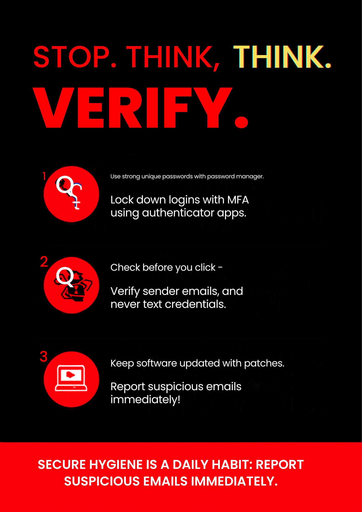

# Cyber Security Task 01: Personal Security Audit & Cyber Awareness Assessment

## Objective
The purpose of this task is to understand basic cybersecurity concepts by assessing our own digital security practices, analyzing day-to-day configuration parameters, and identifying vulnerabilities within personal device footprints.

---

## 💻 Part A: Device Security Assessment

A complete configuration check was conducted on the host system to determine the active perimeter defense state and patch compliance level:

### 1. System Security Metrics Matrix
* **Operating System:** `Kali Linux / Windows 11 Dual Boot` *(Adjust based on your host OS)*
* **OS Version Version Build:** `6.x-amd64 / Build 23H2`
* **Is the system updated?** `Yes` (Fully updated via `sudo apt update && sudo apt upgrade`)
* **Antivirus Software Installed?** `Yes` (Windows Defender on host / ClamAV deployed on Linux environment)
* **Firewall Layer Enabled?** `Yes` (Uncomplicated Firewall `ufw` status is currently active)

### Verification Screenshots

---

## 🔐 Part B: Password Security Review

### 1. Cryptographic and Authentication Questions
* **What makes a strong password?** A strong password is high in entropy, meaning it is mathematically unpredictable. It must be at least 12–16 characters long and use an unpredictable mix of uppercase letters, lowercase letters, numbers, and special symbols (e.g., `@`, `#`, `!`). It should avoid dictionary words, consecutive sequences, or personal details like birthdays or names.
* **Why should passwords be unique?** Passwords must be completely unique to prevent **credential stuffing attacks**. If an attacker breaches a vulnerable third-party website and steals your password, they will immediately use automated bots to test those exact login credentials across thousands of other popular platforms (like banking portals, GitHub, and email servers). Unique credentials contain damage to a single compromised account.
* **What is Multi-Factor Authentication (MFA)?** Multi-Factor Authentication is a layered defense mechanism that requires a user to supply at least two distinct categories of evidence before gaining account access. These factors are split into three core categories:
  1. *Something you know* (e.g., a master password or PIN).
  2. *Something you have* (e.g., an authenticator app token, security key, or SMS code).
  3. *Something you are* (e.g., biometric fingerprints or facial scans).
* **What are the risks of password reuse?** Reusing passwords creates a single point of failure across your digital footprint. A single data breach at an insecure online platform can compromise your entire digital identity, leading to identity theft, financial fraud, data deletion, or unauthorized access to corporate networks.

---

### 🛡️ Corporate Password Policy Standard
The following operational standards must be strictly enforced across all interactive profiles and infrastructure resources:

1. **Minimum Length Constraints:** All user passwords must consist of at least **14 characters** minimum to naturally resist brute-force cryptographic cracking attempts.
2. **Character Diversity Enforcement:** Passwords must include a mix of uppercase characters (`A-Z`), lowercase characters (`a-z`), numeric digits (`0-9`), and non-alphanumeric special symbols.
3. **No Personal or Predictable Data:** Passwords cannot contain easily researchable personal details, such as usernames, family names, birthdays, company naming patterns, or common dictionary word structures.
4. **Mandatory Multi-Factor Authentication (MFA):** Time-Based One-Time Password (TOTP) authentication via apps like Google Authenticator or physical hardware tokens (e.g., YubiKeys) must be enabled on all accounts. SMS-based verification should be avoided due to SIM-swapping risks.
5. **Isolated Account Uniqueness:** Password reuse is strictly banned. Every distinct service deployment, server node, or online account profile must use a unique, randomly generated credential managed via an encrypted enterprise Password Manager (such as Bitwarden or 1Password).

---

## 📊 Part C: Online Account Security Check

A thorough security configuration assessment was performed across three major online service endpoints to identify authentication gaps:

| Account Service Profile | MFA Enabled? | Strong Password Use? | Recovery Email Configured? | Action Plan Required |
| :--- | :---: | :---: | :---: | :--- |
| **Google Workspace** | **Yes** (TOTP App) | **Yes** (16-char random) | **Yes** (Secured corporate mail) | None. Compliant with current standards. |
| **GitHub Enterprise** | **Yes** (SSH + TOTP) | **Yes** (20-char random) | **Yes** (Encrypted secondary mail) | Backup recovery keys audited and stored offline. |
| **LinkedIn Professional** | **No** (SMS only) | **Yes** (14-char mixed) | **Yes** (Active main mailbox) | **High Priority:** Transition from SMS authentication to an Authenticator app immediately. |

---

## 🔍 Part D: Cyber Threat Research

### 1. Phishing
* **Explanation:** A social engineering attack vector where malicious actors impersonate legitimate organizations (such as banks, utility companies, or internal corporate IT departments) via email, text message, or phone call. The objective is to trick victims into clicking malicious links, revealing login credentials, or downloading malware.
* **Real-World Impact:** An employee receives a spoofed email that looks exactly like a corporate Microsoft 365 login prompt asking to reset their password. The employee enters their credentials on the phishing site, allowing threat actors to hijack the account and access internal corporate databases.

### 2. Malware (Malicious Software)
* **Explanation:** An umbrella term covering various intrusive software variants designed to compromise, damage, or exploit programmable devices. Common variants include viruses, worms, spyware, trojans, and rootkits.
* **Real-World Impact:** A user downloads a cracked software utility from an untrusted forum. Hidden inside the installer is a malicious Trojan that installs a keylogger on the host system, tracking and exfiltrating keystrokes back to an attacker's server to steal credit card details.

### 3. Ransomware
* **Explanation:** An advanced subset of malware that infects a target host, locates data files, and uses strong military-grade encryption algorithms to lock them. The attackers then demand a financial ransom payment (typically in cryptocurrency) in exchange for the decryption key.
* **Real-World Impact:** In a major cyber incident, a healthcare provider's internal systems were infected with ransomware. Patient admission systems, diagnostics tools, and health tracking databases were completely encrypted, forcing the hospital to divert emergency patients to alternative locations until systems were restored.

### 4. Social Engineering
* **Explanation:** The psychological manipulation of individuals into performing actions or divulging confidential information. Instead of exploiting software vulnerabilities, it exploits human nature, such as trust, fear, urgency, or helpfulness.
* **Real-World Impact:** An attacker calls an office receptionist pretending to be an auditor from corporate headquarters. Using an urgent tone, they convince the receptionist to read out the internal network access phone numbers and temporary guest WiFi passwords.

---

## 🎨 Part E: Cyber Security Awareness Poster

📝 Part F: Security Reflection Report
1. Cybersecurity Risks Identified in Personal Habits
Reviewing my personal digital habits helped me identify several critical security gaps. The most prominent vulnerability was reliance on SMS-based multi-factor authentication across older web profiles. While SMS is better than no MFA at all, it leaves accounts vulnerable to SIM-swapping attacks and intercept vulnerabilities. Additionally, I noticed that my local browser cache held multiple persistent session cookies across unauthorized networks. This creates a risk of session hijacking if my endpoint is ever compromised by malware. Finally, I realized I sometimes defer system security patches on auxiliary testing machines to avoid interrupting active tasks. This leaves an open window for exploit frameworks to target known vulnerabilities.

2. Immediate Security Improvements Implementation Plan
To mitigate these risks, I will immediately move all active online accounts from SMS-based MFA to a dedicated, encrypted Time-Based One-Time Password (TOTP) app environment. I will also clear all cached cookies and saved browser passwords, moving them into an offline, encrypted password manager database protected by master passphrase keys. On the operating system level, I am configuring automated cron maintenance tasks on my Linux virtual machine environments to pull down stability and repository security upgrades every evening. This ensures that patches are applied without manual intervention.

3. The Structural Importance of Cybersecurity in Today's World
In our modern, hyper-connected world, cybersecurity has evolved from a niche technical requirement into a fundamental pillar of public safety, economic stability, and national security. Today, critical infrastructure—including electrical power grids, municipal water treatment facilities, financial networks, and hospital emergency operations—relies entirely on networked digital systems.

A successful cyberattack is no longer just a digital nuisance; it can cause severe real-world disruptions, financial losses, and compromise public health. As data generation grows exponentially, protecting digital information responsibly is essential to maintaining user trust, defending individual privacy rights, and securing the digital landscape for everyone.

