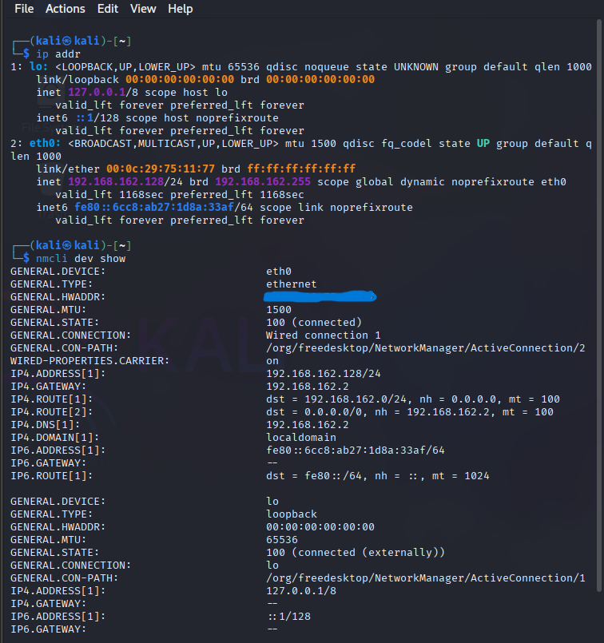
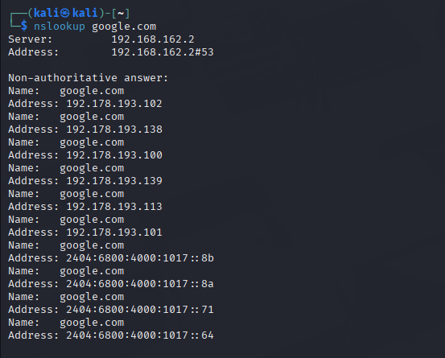
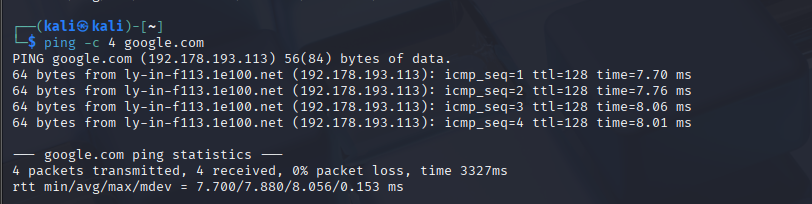

# Networking Task 02: Network Devices & IP Addressing

## Objective

The objective of this task is to gain a better understanding of common networking devices, IP address classifications, and the process through which data is transmitted across a network.

---

# Part A: Network Devices Research

## 1. Router

### Purpose

A router connects different networks and enables communication between them, such as linking a home network to the Internet. It operates primarily at Layer 3 (Network Layer) of the OSI model.

### How It Works

Routers examine the destination IP address contained in incoming packets and use routing tables to determine the most appropriate path for forwarding traffic toward its destination.

### Real-World Example

A home Wi-Fi router supplied by an Internet Service Provider (ISP) allows multiple devices within a household to access the Internet through a single connection.

---

## 2. Switch

### Purpose

A switch connects multiple devices within the same Local Area Network (LAN), enabling efficient communication between them.

### How It Works

Operating at Layer 2 (Data Link Layer), a switch reads destination MAC addresses and forwards data only to the port associated with the intended recipient, reducing unnecessary traffic.

### Real-World Example

A network switch in a university computer laboratory connects numerous computers to local servers and shared resources.

---

## 3. Hub

### Purpose

A hub is a basic networking device used to connect multiple devices within a network.

### How It Works

Unlike a switch, a hub operates at the Physical Layer and simply broadcasts incoming data to all connected ports without analyzing the destination. This often results in network congestion and collisions.

### Real-World Example

Hubs are primarily found in older network environments and have largely been replaced by switches due to their inefficiency and security limitations.

---

## 4. Access Point (AP)

### Purpose

An Access Point extends a wired network into a wireless environment, allowing devices to connect through Wi-Fi.

### How It Works

The access point connects to a router or switch using an Ethernet cable and broadcasts wireless signals (SSID), enabling wireless devices to communicate with the network.

### Real-World Example

Wireless access points installed throughout office buildings provide seamless Wi-Fi connectivity for employees and visitors.

---

## 5. Firewall

### Purpose

A firewall serves as a security mechanism that monitors and controls incoming and outgoing network traffic according to predefined security policies.

### How It Works

It examines packet information such as source and destination addresses, ports, protocols, and connection states, allowing legitimate traffic while blocking unauthorized or potentially harmful activity.

### Real-World Example

Organizations deploy next-generation firewalls to protect corporate networks and data centers from cyberattacks, unauthorized access, and malicious traffic.

---

## 6. Modem

### Purpose

A modem establishes communication between a local network and the ISP by converting signals between different transmission formats.

### How It Works

The term modem comes from **Modulator-Demodulator**. It converts digital signals into analog signals for transmission and converts incoming analog signals back into digital form.

### Real-World Example

Cable, DSL, and fiber modems provide Internet connectivity by linking residential or business networks to the ISP's infrastructure.

---

# Part B: IP Address Classification

| IP Address        | Classification | Explanation                                                                                   |
| ----------------- | -------------- | --------------------------------------------------------------------------------------------- |
| **192.168.1.10**  | Private        | Falls within the RFC 1918 private Class C range (192.168.0.0 – 192.168.255.255).              |
| **10.0.0.5**      | Private        | Belongs to the RFC 1918 private Class A range (10.0.0.0 – 10.255.255.255).                    |
| **172.16.5.20**   | Private        | Located within the RFC 1918 private Class B range (172.16.0.0 – 172.31.255.255).              |
| **8.8.8.8**       | Public         | A publicly routable IP address operated by Google as a public DNS service.                    |
| **1.1.1.1**       | Public         | A publicly accessible DNS resolver operated by Cloudflare.                                    |
| **192.168.100.1** | Private        | Part of the RFC 1918 private Class C address space, commonly used as a local gateway address. |

---

# Part C: Understanding Your Network

Based on the Kali Linux network configuration:

* **IPv4 Address:** `192.168.162.128`
* **Default Gateway:** `192.168.162.2`
* **DNS Server:** `192.168.162.2`

## Questions and Answers

### 1. Which IP range does your device belong to?

The device belongs to the private network range **192.168.162.0/24**, which uses the subnet mask **255.255.255.0**.

### 2. Is the IP address Public or Private?

The assigned IP address is a **private IP address**. It is intended for communication within the local network and cannot be directly accessed from the public Internet.

### 3. What role does the router perform in the network?

The router functions as the network gateway. It forwards traffic between the local network and external networks while performing Network Address Translation (NAT), allowing multiple devices to share a single public IP address.

### 4. What would happen if the DNS server stopped functioning?

If the DNS server became unavailable, domain names such as `google.com` could no longer be translated into IP addresses. As a result, websites would not be accessible through their domain names, although direct connections using IP addresses would still be possible.

---

## Network Configuration Screenshot

**Network Configuration Output**



---

# Part D: Network Communication Flow

The following diagram illustrates how a browser accesses `www.google.com`:

```text
[ Kali Device ] ──(1. DNS Query)──► [ DNS Server ]
      │                                   │
(4. HTTPS Request via Gateway)       (2. Domain Resolution)
      │                                   │
      ▼                                   ▼
[ Local Router ] ──(3. DNS Response)──────┘
      │
      ├──(5. NAT and Internet Routing)──► [ Google Server ]
      │
      ◄──(6. HTTPS Response)─────────────┘
```

---

# How a Browser Loads [www.google.com](http://www.google.com)

## Step 1: DNS Query

When a user enters `www.google.com`, the browser first checks its local DNS cache.

* If the domain information is cached, the browser uses it immediately.
* If no cached record exists, a DNS request is sent to the configured DNS server to obtain the corresponding IP address.

---

## Step 2: Domain Name Resolution

The DNS server processes the request and searches for the appropriate DNS records.

* The domain name is translated into a public IP address.
* The resolved address is returned to the client.

Example:

```text
www.google.com → 142.250.x.x
```

---

## Step 3: TCP Three-Way Handshake

Once the IP address is obtained, the client establishes a reliable connection with the server using TCP.

```text
Client                     Server
  | ------ SYN ---------> |
  | <---- SYN-ACK ------- |
  | ------ ACK ---------> |
```

This process ensures that both systems are ready to exchange data.

---

## Step 4: HTTPS Communication

After the connection is established:

1. The browser sends an encrypted HTTPS request.
2. Google's server processes the request.
3. The server responds with webpage resources, including:

   * HTML files
   * CSS stylesheets
   * JavaScript files
   * Images and media content
4. The response travels back through the Internet and local gateway.
5. The browser renders the webpage for the user.

```text
Browser ── HTTPS Request ──► Google Server
Browser ◄─ HTTPS Response ── Google Server
```

---

## Overall Communication Process

```text
Browser
   │
   ▼
DNS Query
   │
   ▼
DNS Response
   │
   ▼
TCP Three-Way Handshake
(SYN → SYN-ACK → ACK)
   │
   ▼
HTTPS Request
   │
   ▼
Server Processing
   │
   ▼
HTTPS Response
   │
   ▼
Webpage Displayed
```

---

# Part E: Practical Command Exercise

## Diagnostic Analysis

### 1. What IP address was returned by DNS for Google?

The `nslookup google.com` command successfully resolved the domain and returned the following IP address:

```text
Name: google.com
Address: 192.178.193.102
```



---

### 2. Was the ping successful?

Yes. The `ping` command completed successfully.

The results indicated:

* Successful packet transmission and reception
* No packet loss
* Consistent round-trip times
* Verified connectivity between the local host and Google's servers

---

### 3. Why is DNS important before communication begins?

DNS (Domain Name System) translates human-readable domain names into numerical IP addresses that computers use for communication.

For example:

```text
google.com → 142.250.190.46
```

Without DNS, users would need to memorize and manually enter IP addresses for every website they wish to access. DNS simplifies network communication by automatically performing this translation process.

---

# Configuration and Command Output Screenshots

## 1. Network Interface Configuration

**Linux/macOS**


---

## 2. Connectivity Test Results



---

## 3. DNS Lookup Results


---

# Conclusion

This practical exercise demonstrated the fundamental process of network communication and domain name resolution. DNS successfully converted a human-readable domain name into a routable IP address, while connectivity testing confirmed successful communication with Google's servers. The results provided a clear understanding of how devices interact within a network and access resources across the Internet.

